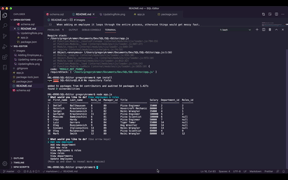

# SQL-Editor

"You've been chosen as an extra in the movie adaptation of the SQL to your life" -Pavement

This is an application to handle your new venture capital empire's vast workforce.  You can add employees, roles and departments and update them.

# Demo

# Instructions
Run the terminal command "node app.js" to run the program.

# Notes
When adding an employee it loops through the entire process, otherwise things would get messy fast.

# Images
The images in the images folder show some of the functions (gifs were not legible)

# Additions to make:
The delete function still needs a SQL update to work properly

